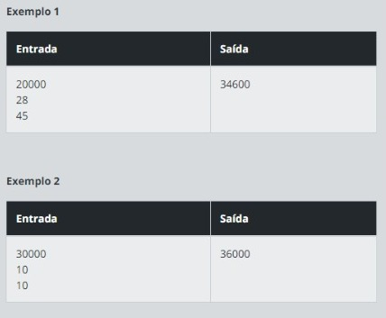
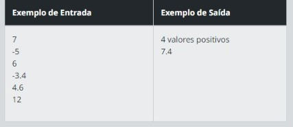
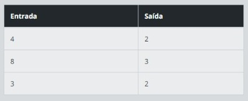
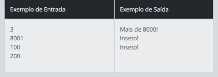
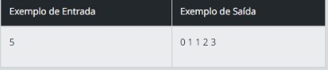

<h1 align="center">🔴🟡🟢Desafios_de_Codigo_DIO-PAN🟢🟡🔴</h1>

Repositório onde apresentarei as soluções dos desafios de código!

  <a href="#-tecnologias">Tecnologias</a>&nbsp;&nbsp;&nbsp;|&nbsp;&nbsp;&nbsp;
  <a href="#-projeto">Projeto</a>&nbsp;&nbsp;&nbsp;|&nbsp;&nbsp;&nbsp;
  <a href="#-challenges">Challenges</a>
 

  

>🟡 Projeto em construção

> <strong>Deixa uma estrelinha?🙏⭐</strong>

## 👩‍💻 Tecnologias

Esse projeto foi desenvolvido com as seguintes tecnologias:

- Java
- Intellij Idea
- Git e Github

 

## 💻 Projeto

Códigos desenvolvidos durante o bootcamp <strong>Banco PAN Java Developer</strong>☕.

 

# 🥇 Challenges

<h2 align="center" >Dominando Algoritmos Básicos com Desafios de Código Java</h2>

 

## 🚗🚙 Fábrica de Carros

O custo de um carro novo ao consumidor é a soma do custo de fábrica com a porcentagem do distribuidor e dos impostos (aplicados ao custo de fábrica). O gerente de uma loja de carros gostaria de um programa para calcular o preço de um carro novo para os clientes. Você receberá o custo de fábrica e as porcentagens referentes ao distribuidor e os impostos e deverá escrever programa para ler esses valores e imprimir o valor final do carro.

### 🟩 Entrada

Você recebera três valores inteiros que representam o custo de fábrica, as porcentagens do distribuidor e os impostos.

### 🟥 Saída

Como saída, teremos o valor final do preço de um carro novo.

  

<strong>RESPOSTA: <a href="../Dominando_Algoritmos_Basicos/src/FabricaDeCarros.java">CLIQUE AQUI!</a></strong>

 

## ➕➗ Imprimindo Positivos e Média

Leia 6 valores. Em seguida, mostre quantos destes valores digitados foram positivos. Na próxima linha, deve-se mostrar a média de todos os valores positivos digitados, com um dígito após o ponto decimal.

### 🟩 Entrada

A entrada contém 6 números que podem ser valores inteiros ( int ) ou de ponto flutuante ( float ou double ). Pelo menos um destes números será positivo.

### 🟥 Saída

O primeiro valor de saída é a quantidade de valores positivos. A próxima linha deve mostrar a média dos valores positivos digitados.

  

<strong>RESPOSTA: <a href="../Dominando_Algoritmos_Basicos/ImprimindoPositivosEMedia.java">CLIQUE AQUI!</a></strong>

 

## ✅ Desafio: Soma de H com N Termos

Neste desafio, faça um programa que calcule o valor de H com N termos. 

Sendo, H = 1 + 1/2 + 1/3 + 1/4 + ... + 1/N. 

### 🟩 Entrada

A entrada consiste em um número inteiro positivo.

### 🟥 Saída

Na saída será impresso o valor que representa a soma dos termos.

  

<strong>RESPOSTA: <a href="../Dominando_Algoritmos_Basicos/SomaHcomN.java">CLIQUE AQUI!</a></strong>

 

## 🐲 Desafio: Dragão!

Daenerys é a khaleesi dos Dothraki. Juntamente com Drogon, eles vão atrás do Tyrion, para tentar dominar Westeros. Ela possui, além do seu dragãozinho, um rastreador que mede o nível de energia de qualquer ser vivo. Todos os seres com o nível menor ou igual a 8000, ela considera como se fosse um inseto. Quando passa deste valor, que foi o caso do Drogon, ela se espanta e grita “Mais de 8000”. Baseado nisso, utilize a mesma tecnologia e analise o nível de energia dos seres vivos.

### 🟩 Entrada

A primeira linha contém um número inteiro C relativo ao número de casos de teste. Em seguida, haverá C linhas, com um número inteiro N (100 <= N <= 100000) relativo ao nível de energia de um ser vivo.

### 🟥 Saída

Para cada valor lido, imprima o texto correspondente.

  

<strong>RESPOSTA: <a href="../Dominando_Algoritmos_Basicos/Dragao.java">CLIQUE AQUI!</a></strong>

 

## ▪◼ Fibonacci Fácil

A seguinte sequência de números 0 1 1 2 3 5 8 13 21... é conhecida como série de Fibonacci. Nessa sequência, cada número, depois dos 2 primeiros, é igual à soma dos 2 anteriores. Escreva um algoritmo que leia um inteiro N (N < 46) e mostre os N primeiros números dessa série.

### 🟩 Entrada

O arquivo de entrada contém um valor inteiro N (0 < N < 46).

### 🟥 Saída

Os valores devem ser mostrados na mesma linha, separados por um espaço em branco. Não deve haver espaço após o último valor.

  

<strong>RESPOSTA: <a href="../Dominando_Algoritmos_Basicos/FibonacciFacil.java">CLIQUE AQUI!</a></strong>

