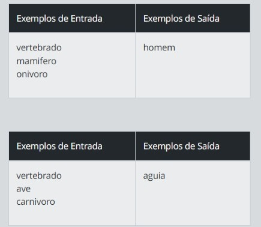
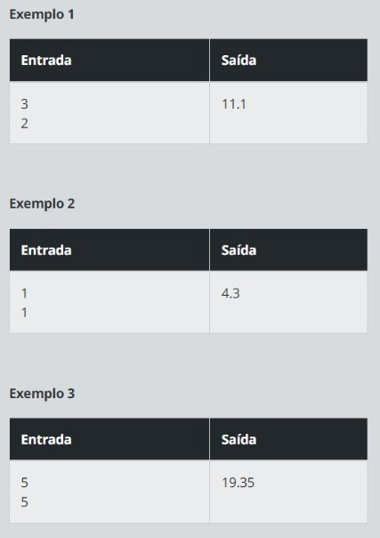
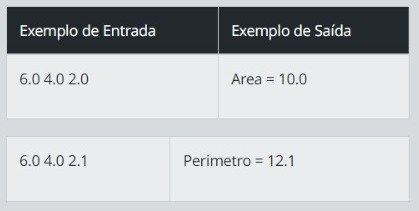
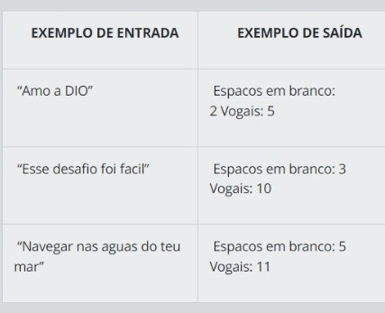
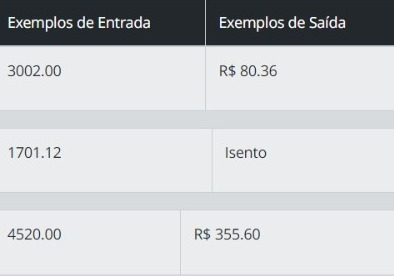

<h1 align="center">🔴🟡🟢Desafios_de_Codigo_DIO-PAN🟢🟡🔴</h1>

Repositório onde apresentarei as soluções dos desafios de código!

  <a href="#-tecnologias">Tecnologias</a>&nbsp;&nbsp;&nbsp;|&nbsp;&nbsp;&nbsp;
  <a href="#-projeto">Projeto</a>&nbsp;&nbsp;&nbsp;|&nbsp;&nbsp;&nbsp;
  <a href="#-challenges">Challenges</a>
 

  

>🟡 Projeto em construção

> <strong>Deixa uma estrelinha?🙏⭐</strong>

## 👩‍💻 Tecnologias

Esse projeto foi desenvolvido com as seguintes tecnologias:

- Java
- Intellij Idea
- Git e Github

 

## 💻 Projeto

Códigos desenvolvidos durante o bootcamp <strong>Banco PAN Java Developer</strong>☕.

 

# 🥇 Challenges

<h2 align="center" >Dominando Algoritmos Básicos com Desafios de Código Java</h2>

 

## 🚗🚙 Fábrica de Carros

O custo de um carro novo ao consumidor é a soma do custo de fábrica com a porcentagem do distribuidor e dos impostos (aplicados ao custo de fábrica). O gerente de uma loja de carros gostaria de um programa para calcular o preço de um carro novo para os clientes. Você receberá o custo de fábrica e as porcentagens referentes ao distribuidor e os impostos e deverá escrever programa para ler esses valores e imprimir o valor final do carro.

### 🟩 Entrada

Você recebera três valores inteiros que representam o custo de fábrica, as porcentagens do distribuidor e os impostos.

### 🟥 Saída

Como saída, teremos o valor final do preço de um carro novo.

  

<strong>RESPOSTA: <a href="./Dominando_Algoritmos_Basicos/src/FabricaDeCarros.java">CLIQUE AQUI!</a></strong>

 

## ➕➗ Imprimindo Positivos e Média

Leia 6 valores. Em seguida, mostre quantos destes valores digitados foram positivos. Na próxima linha, deve-se mostrar a média de todos os valores positivos digitados, com um dígito após o ponto decimal.

### 🟩 Entrada

A entrada contém 6 números que podem ser valores inteiros ( int ) ou de ponto flutuante ( float ou double ). Pelo menos um destes números será positivo.

### 🟥 Saída

O primeiro valor de saída é a quantidade de valores positivos. A próxima linha deve mostrar a média dos valores positivos digitados.

  

<strong>RESPOSTA: <a href="./Dominando_Algoritmos_Basicos/src/ImprimindoPositivosEMedia.java">CLIQUE AQUI!</a></strong>

 

## ✅ Desafio: Soma de H com N Termos

Neste desafio, faça um programa que calcule o valor de H com N termos. 

Sendo, H = 1 + 1/2 + 1/3 + 1/4 + ... + 1/N. 

### 🟩 Entrada

A entrada consiste em um número inteiro positivo.

### 🟥 Saída

Na saída será impresso o valor que representa a soma dos termos.

  

<strong>RESPOSTA: <a href="./Dominando_Algoritmos_Basicos/src/SomaHcomN.java">CLIQUE AQUI!</a></strong>

 

## 🐲 Desafio: Dragão!

Daenerys é a khaleesi dos Dothraki. Juntamente com Drogon, eles vão atrás do Tyrion, para tentar dominar Westeros. Ela possui, além do seu dragãozinho, um rastreador que mede o nível de energia de qualquer ser vivo. Todos os seres com o nível menor ou igual a 8000, ela considera como se fosse um inseto. Quando passa deste valor, que foi o caso do Drogon, ela se espanta e grita “Mais de 8000”. Baseado nisso, utilize a mesma tecnologia e analise o nível de energia dos seres vivos.

### 🟩 Entrada

A primeira linha contém um número inteiro C relativo ao número de casos de teste. Em seguida, haverá C linhas, com um número inteiro N (100 <= N <= 100000) relativo ao nível de energia de um ser vivo.

### 🟥 Saída

Para cada valor lido, imprima o texto correspondente.

  

<strong>RESPOSTA: <a href="./Dominando_Algoritmos_Basicos/src/Dragao.java">CLIQUE AQUI!</a></strong>

 

## ▪◼ Fibonacci Fácil

A seguinte sequência de números 0 1 1 2 3 5 8 13 21... é conhecida como série de Fibonacci. Nessa sequência, cada número, depois dos 2 primeiros, é igual à soma dos 2 anteriores. Escreva um algoritmo que leia um inteiro N (N < 46) e mostre os N primeiros números dessa série.

### 🟩 Entrada

O arquivo de entrada contém um valor inteiro N (0 < N < 46).

### 🟥 Saída

Os valores devem ser mostrados na mesma linha, separados por um espaço em branco. Não deve haver espaço após o último valor.

  

<strong>RESPOSTA: <a href="./Dominando_Algoritmos_Basicos/src/FibonacciFacil.java">CLIQUE AQUI!</a></strong>

 

## 🐔 Desafio: Animal

Neste problema, você deverá ler 3 palavras que definem o tipo de animal possível segundo o esquema abaixo, da esquerda para a direita.  Em seguida conclua qual dos animais seguintes foi escolhido, através das três palavras fornecidas.

  

### 🟩 Entrada

A entrada contém 3 palavras, uma em cada linha, necessárias para identificar o animal segundo a figura acima, com todas as letras minúsculas.

### 🟥 Saída

Imprima o nome do animal correspondente à entrada fornecida.

  

<strong>RESPOSTA: <a href="./Dominando_Algoritmos_Intermediarios/src/Animal.java">CLIQUE AQUI!</a></strong>

 

## 👨‍🦳🏚 Desafio: Quitandado seu Zé

Seu Zé está vendendo frutas com a seguinte tabela de preços:

  

Se o cliente comprar mais de 8 Kg em frutas ou o valor total da compra ultrapassar R$ 25,00, receberá ainda um desconto de 10% sobre este total. Escreva um algoritmo para ler a quantidade (em Kg) de morangos e a quantidade (em Kg) de maças adquiridas e escreva o valor a ser pago pelo cliente.

### 🟩 Entrada

Como entrada, você recebera a quantidade em kg de morangos e a quantidade em kg de maçãs.

### 🟥 Saída

Será o valor a ser pago pelo cliente, conforme a tabela de preços da quintanda do seu Zé.

  

<strong>RESPOSTA: <a href="./Dominando_Algoritmos_Intermediarios/src/Quitanda.java">CLIQUE AQUI!</a></strong>

 

## 🔺 Desafio: Triângulo

Leia 3 valores reais (A, B e C) e verifique se eles formam ou não um triângulo. Em caso positivo, calcule o perímetro do triângulo (soma de todos os lados) e apresente a mensagem:

<strong>Perimetro = XX.X</strong>

Em caso negativo, calcule a área do trapézio que tem A e B como base e C como altura, mostrando a mensagem:

<strong>Area = XX.X</strong>

<strong>Fórmula da área de um trapézio: AREA = ((A + B) x C) / 2</strong>

### 🟩 Entrada

A entrada contém três valores reais.

### 🟥 Saída

O resultado deve ser apresentado com uma casa decimal.

  

<strong>RESPOSTA: <a href="./Dominando_Algoritmos_Intermediarios/src/Triangulo.java">CLIQUE AQUI!</a></strong>

 

## 🅰 Desafio: Conta Espaços e Vogais

Jorginho é professor do primário de uma determinada escola. Ele tem 100000 alunos e precisa criar um programa que verifica quantos espaços em branco e quantas vogais existem em uma determinada string de entrada que os alunos entregaram na avaliação final. Ajude-o a realizar essa tarefa antes que o tempo para entrega-la no fim do semestre acabe!

### 🟩 Entrada

A entrada será uma frase no formato de string. 

### 🟥 Saída

A saída deverá retornar quantos espaços em branco e quantas vogais existem na determinada string, conforme exemplo abaixo:

  

<strong>RESPOSTA: <a href="./Dominando_Algoritmos_Intermediarios/src/ContaEspacosEVogais.java">CLIQUE AQUI!</a></strong>

 

## 💸 Desafio: Taxa de Imposto de Renda

Há um país denominado Lolipad, todos os habitantes ficam felizes em pagar seus impostos, pois sabem que nele não existem políticos corruptos e os recursos arrecadados são utilizados em benefício da população, sem qualquer desvio. A moeda deste país é o Loli, cujo símbolo é o R$.

Você terá o desafio de ler um valor com duas casas decimais, equivalente ao salário de uma pessoa de Loli. Em seguida, calcule e mostre o valor que esta pessoa deve pagar de Imposto de Renda, segundo a tabela abaixo.

  

Lembre que, se o salário for R$ 3002.00, a taxa que incide é de 8% apenas sobre R$ 1000.00, pois a faixa de salário que fica de R$ 0.00 até R$ 2000.00 é isenta de Imposto de Renda. No exemplo fornecido (abaixo), a taxa é de 8% sobre R$ 1000.00 + 18% sobre R$ 2.00, o que resulta em R$ 80.36 no total. O valor deve ser impresso com duas casas decimais.

### 🟩 Entrada

A entrada contém apenas um valor de ponto flutuante, com duas casas decimais. 

### 🟥 Saída

Imprima o texto "R$" seguido de um espaço e do valor total devido de Imposto de Renda, com duas casas após o ponto. Se o valor de entrada for menor ou igual a 2000, deverá ser impressa a mensagem "Isento".

  

<strong>RESPOSTA: <a href="./Dominando_Algoritmos_Intermediarios/src/TaxaEImpostoDeRenda.java">CLIQUE AQUI!</a></strong>

 